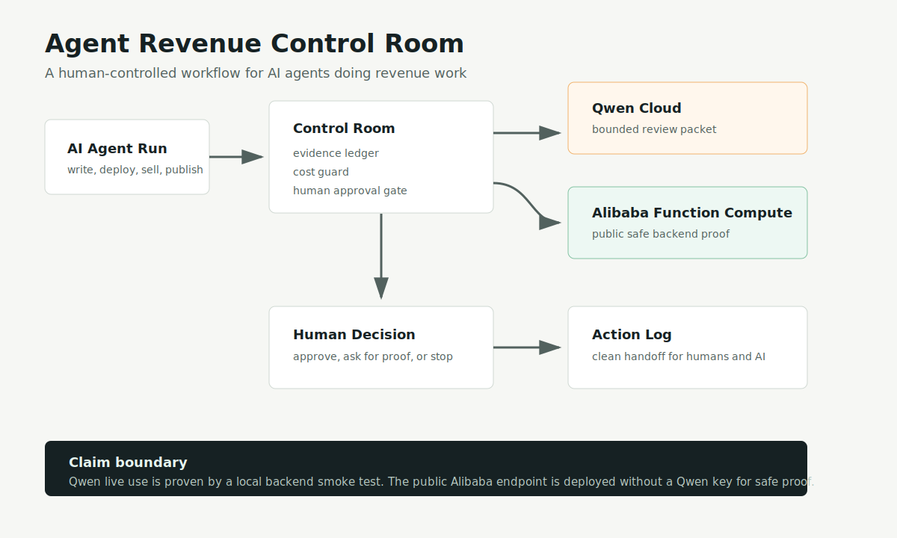
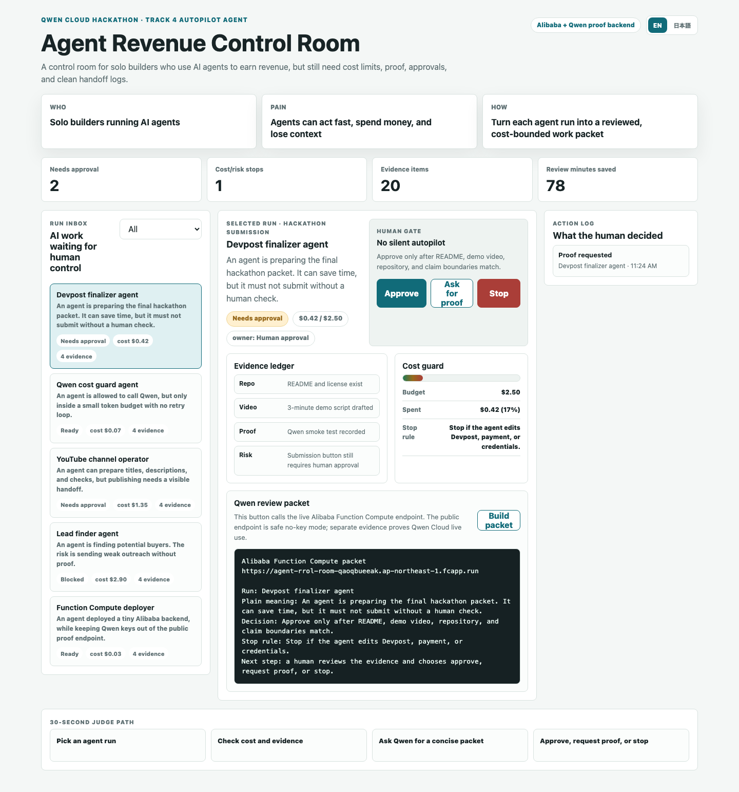
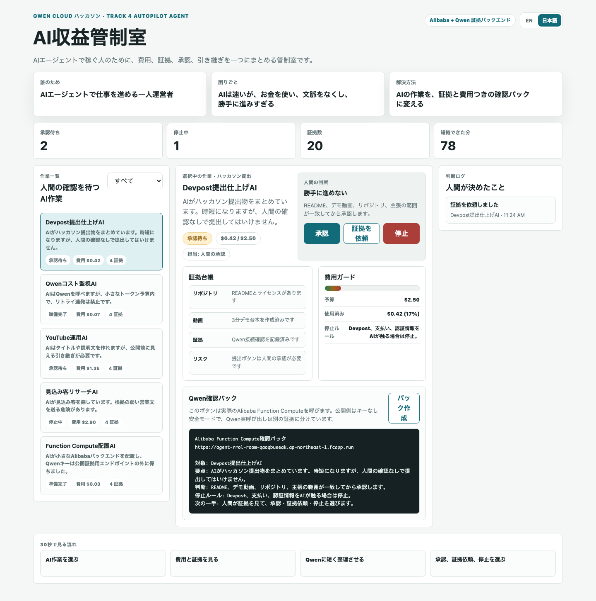
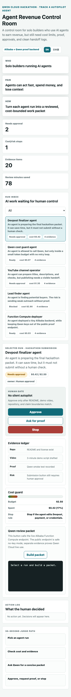

# Agent Revenue Control Room

AI agents are becoming useful coworkers.
They can write, search, deploy, publish, and sell.
That is powerful, but it creates a simple problem:

**If an AI agent is doing real work, the human needs a control room.**

Agent Revenue Control Room is that control room.

It helps a solo builder see what each agent did, how much it may cost, what proof exists, what needs approval, and what should be handed to the next human or AI.

## Who, Problem, Solution

| Question | Answer |
|---|---|
| Who is this for? | Solo builders and small teams using AI agents to do revenue work. |
| What is hard? | AI agents move fast, but cost, proof, approvals, and handoffs get messy. |
| What does this do? | It turns each AI-agent run into a clear review packet with evidence, cost guardrails, and a human decision log. |

## Why This Fits Qwen Cloud

This is built for the **Global AI Hackathon Series with Qwen Cloud**, Track 4: **Autopilot Agent**.

The app uses Qwen where it is useful and safe:

- summarize an agent run
- explain the evidence
- restate the cost boundary
- prepare a human handoff

Qwen does **not** silently approve work.
The human still chooses:

- approve
- ask for proof
- stop

## Current Build Status

```text
Static app UI                         ████████░░ 8/10
Japanese / English UI                 █████████░ 9/10
Qwen backend code                     █████████░ 9/10
Local verification                    ██████████ 10/10
Alibaba Function Compute deployment   ████████░░ 8/10
Architecture diagram                  ██████████ 10/10
Captioned demo video asset            ████████░░ 8/10
Final Devpost submission              ░░░░░░░░░░ 0/10
```

Current claim boundary:

- the local app works
- the backend is deployed on Alibaba Cloud Function Compute
- the public Alibaba endpoint is reachable and intentionally has no Qwen API key configured
- the backend code has completed one live Qwen Cloud smoke test from the local machine
- architecture and captioned demo video assets exist in `media/`
- final Devpost submission is not yet claimed

Live evidence:

```text
evidence/2026-05-28T014405Z_backend-qwen-live-smoke.json
evidence/2026-05-28T021155Z_alibaba-function-compute-live-health.json
```

## Screenshots

Architecture:



English desktop:



Japanese desktop:



Mobile:



Demo video:

[Captioned demo video](media/demo-walkthrough.mp4)

Demo script:

```text
docs/demo-script.md
```

## What You Can Try

Live app:

```text
https://daideguchi.github.io/agent-revenue-control-room/
```

Or open `index.html` locally.

You can:

1. Pick an AI-agent run.
2. Check its evidence ledger.
3. Check the cost guard.
4. Build a Qwen review packet.
5. Approve, ask for proof, or stop.
6. See the decision appear in the action log.

## Local Verification

```bash
npm install
npm run verify
```

This creates screenshots:

```text
media/agent-revenue-control-room-full.png
media/agent-revenue-control-room-mobile.png
```

## Backend

The backend lives here:

```text
backend/alibaba-function-compute/server.mjs
backend/alibaba-function-compute/app.py
```

It exposes:

```text
GET  /healthz
POST /api/qwen-brief
```

Offline smoke:

```bash
npm run backend:smoke:offline
QWEN_OFFLINE_MODE=1 PORT=9107 python3 backend/alibaba-function-compute/app.py
```

Alibaba Function Compute ZIP package:

```text
dist/alibaba-fc-python-backend.zip
```

This package contains `app.py` and matches the console default startup command `python3 app.py`.

Deployed proof endpoint:

```text
https://agent-rrol-room-qaoqbueeak.ap-northeast-1.fcapp.run/healthz
```

The public endpoint is safe for proof screenshots:

- it runs on Alibaba Cloud Function Compute
- it returns `qwen_key_present: false`
- it returns `offline_mode: true`
- it does not expose or require a Qwen API key

The real Qwen call is proven separately by the live smoke evidence file above.

Live Qwen calls require an environment variable:

```text
DASHSCOPE_API_KEY
```

Never commit or screenshot the raw key.

## Japanese Summary

AI収益管制室は、AIエージェントで仕事を進める人のための確認画面です。

AIは速く動けます。
でも、お金を使ったり、証拠を忘れたり、次の人に何をしたか伝わらなくなったりします。

このツールは、AIの作業を次の形に整理します。

- 何をしたか
- いくら使ったか
- どんな証拠があるか
- 人間の承認が必要か
- 次に何をすべきか

人間だけでなく、次のAIにも引き継ぎやすい形にすることが目的です。

## Docs

- [Architecture](docs/architecture.md)
- [Cost guard](docs/cost-guard.md)
- [Demo script](docs/demo-script.md)
- [Submission plan](docs/submission-plan.md)

## License

MIT
